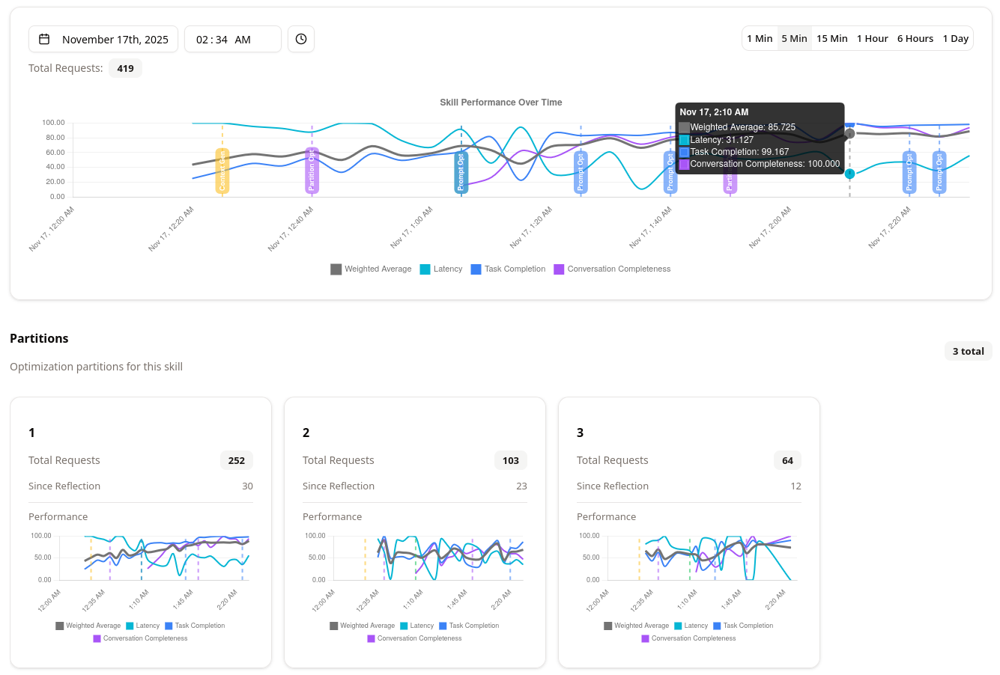

# Reactive Agents

> Automatically optimize your AI agents based on performance with OpenAI API compatibility.

## What is Reactive Agents?

Reactive Agents is a self-optimizing AI agent platform that automatically improves your agents by adjusting hyperparameters and system prompts based on their performance. Simply point your existing application to Reactive Agents instead of your AI provider, and it handles the optimization for you.

**Key Features:**
- 🔄 **Automatic optimization** - Continuously improves agents based on real-world performance
- 🎯 **Smart tuning** - Adjusts LLM hyperparameters and system prompts automatically
- 🔌 **OpenAI API compatible** - Works as a drop-in replacement for applications using the OpenAI API
- 🌐 **Multi-provider support** - Route to OpenAI, Anthropic, Google, and other providers
- 📊 **Performance tracking** - Monitor agent performance and improvements over time

**How it works:**
1. Change your API URL from `api.openai.com` to your Reactive Agents instance
2. Reactive Agents proxies requests to your chosen AI provider
3. Performance is tracked and agents are automatically optimized
4. Your application benefits from continuously improving AI agents

---

## 🚦 Getting Started

**Quick Start:**

1. Download the repo:
   ```bash
   git clone https://github.com/idkhub-com/reactive-agents.git
   cd reactive-agents
   ```
   
2. Start the application (Requires [Docker Compose](https://docs.docker.com/compose/install/)):
   ```bash
   docker compose up
   ```
   The application will be available at `http://localhost:3000`.

3. Configure your application from the UI. 
    
    1. In the "AI Providers & Models" section, add the models you want to use. You will be able to select these models within the app settings and within each of your agent's skills later on. You will need at least one LLM model and one embedding model from any provider to configure the application.
    
    2. In the "Settings" section, select the models you want to use for system prompt reflection, evaluation generation, embeddings, and judgment. We recommend that you use smarter models than what your agents will be using, if possible.

--- 

## 🤖 Creating Agents and Skills

1. In the "Agents" section, create your first agent.
    - Name: `calendar_event_planner`.
    - Description: "An agent that can manage calendar events for a user."
2. In the dashboard for the `calendar_event_planner` agent, create a new skill.
    - Name: `generate`.
    - Description: "Generates a calendar event json object from plain text. Only add real names to the participants list."
    - Template variables (under Advanced Settings): `datetime` (A variable that can be used within the skill's prompt, to let the agent know what today's date is.)
    - Leave other fields as they are.
3. Select at least one model you want to use for the `generate` skill. The more models you select, the more possible configurations you will have.
4. Select the evaluation methods you want to use for the `generate` skill. Select "Task Completion" for now. This will evaluate that the responses are creating the proper calendar event json object, with only real names in the participants list.

---

## 🗨️ Sending Requests

1. Create a request as you normally would, in whatever programming language you prefer. Here we will use Python with the OpenAI library, however, you can also make an HTTP request to connect to the Reactive Agents API.

    ```python
    from openai import OpenAI
    from pydantic import BaseModel
    
    client = OpenAI()

    class CalendarEvent(BaseModel):
        name: str
        date: str
        participants: list[str]
    
    user_message = "Alice and Bob are going to a science fair on Friday."
    print("User:", user_message)
    
    response = client.beta.chat.completions.parse(
        model="gpt-4o-mini", # This field will get ignored by the server, but is required by the OpenAI library."
        messages=[
            # No need to include a system prompt, the server will pick a prompt for you on the fly. 
            {
                "role": "user",
                "content": user_message,
            },
        ],
        response_format=CalendarEvent,
    )
    
    agent_response = response.choices[0].message.parsed
    print("\nAgent Response:", agent_response)
    ```
    
2. Configure your request to use Reactive Agents.    
    ```python
      import json
      from datetime import datetime
    
    # from openai import OpenAI
    # from pydantic import BaseModel
    
    # client = OpenAI(
          base_url="http://localhost:3000/v1",
    # )

    # class CalendarEvent(BaseModel):
    #     name: str
    #     date: str
    #     participants: list[str]
    
    # user_message = "Alice and Bob are going to a science fair on Friday."
    # print("User:", user_message)
    
    # Create an object that includes the agent name and skill name and any system prompt variables that you want to pass to the agent.
      ra_config = {
          "agent_name": "calendar_event_planner",
          "skill_name": "generate",
          "system_prompt_variables": {
              "datetime": datetime.now().isoformat(),
          },
      } 
    
    # response = client.beta.chat.completions.parse(
    #     model="gpt-4o-mini", # This field will get ignored by the server, but is required by the OpenAI library."
    #     messages=[
    #         # No need to include a system prompt, the server will pick a prompt for you on the fly. 
    #         {
    #             "role": "user",
    #             "content": user_message,
    #         },
    #     ],
    #     response_format=CalendarEvent,
          extra_headers={
              "ra-config": json.dumps(ra_config),
          },
    # )
    
    # agent_response = response.choices[0].message.parsed
    # print("\nAgent Response:", agent_response)
    ```
    
3. Navigate to the `generate` skill dashboard. When a skill is just created, you will see a "Warming up" message next to the skill name. This is normal and indicates that the skill is warming up. Send 5 requests or so to allow the agent to see the some sample messages, expected response structure, tools, etc. without you having to manually define those. The agent will create the appropriate prompts and evaluations by seeing the sample messages and expected response structure.

4. After a few requests you will see the "Warming up" message disappear. Click on "Manage Evaluations" and double check that the "Task Completion" evaluation is checking for the right qualities. Make adjustments to it if needed. You can also check each log within the skill and see why a specific score was given to it. Setting up evaluations correctly **since the beginning** will allow an agent to find the most optimal configurations faster.

5. Continue to make requests to the server as you normally would. The agent will learn from your interactions and improve over time, creating new configurations, selecting the best ones and improving the quality of the responses.

---

### Production Deployment

> [!WARNING]
> **Experimental Project** - Reactive Agents is currently in active development and is **not production-ready**. We are working on critical features including authorization, performance optimizations, and stability improvements. Use this project for experimentation and development only.

For future production deployment guides and best practices, visit our [documentation](https://docs.reactiveagents.ai).

---

## 📖 Examples

Check out the [examples/](examples/) directory for sample implementations showing how to integrate Reactive Agents with your applications.

---

## 📚 Learn More

- **[Documentation](https://docs.reactiveagents.ai)** - Complete guides and API reference
- [Contributing Guide](CONTRIBUTING.md)
- [Notice](NOTICE)

---

<p align="center">
  <b>Made with ❤️ by the Reactive Agents team</b>
</p>
